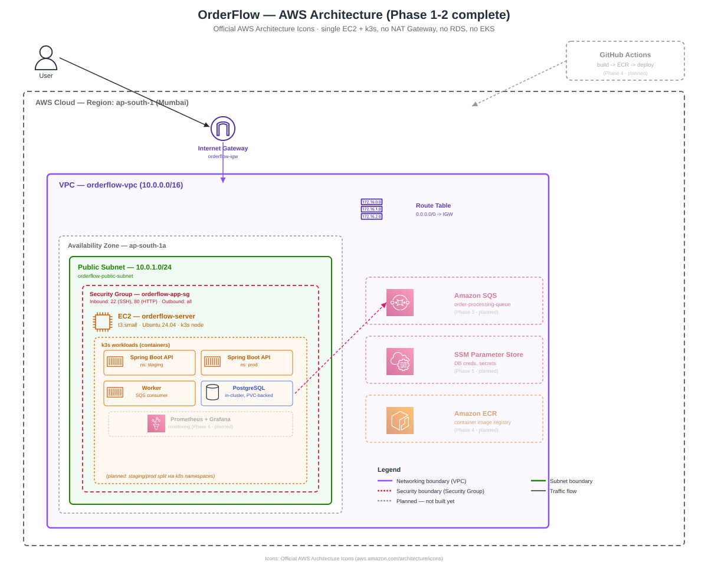

# OrderFlow — Production-Style Order Processing Platform on AWS

> Status: In progress. This README is updated at each phase as the project is built.

## What this project is

A small order-processing service (Spring Boot + Postgres + SQS worker) deployed
to a real AWS environment with staging and production environments, built to
demonstrate production-grade DevOps practices within a strict $10-15/month budget.

This is a deliberately advanced follow-up to an earlier intern-level project
(CloudPath), built to go beyond tutorial-level Docker/Kubernetes into real
cloud infrastructure, multi-environment CI/CD, secrets management, and
observability.

## Architecture (high level)

- Single EC2 instance running k3s, with staging and production as separate namespaces
- Postgres self-hosted in-cluster (not RDS — see Cost Decisions below)
- AWS SQS for async order processing
- Custom VPC, public subnets only, no NAT Gateway (see Cost Decisions)
- Terraform with remote state in S3 + DynamoDB locking
- Secrets in AWS SSM Parameter Store
- GitHub Actions: build -> ECR -> deploy staging -> manual approval -> deploy prod
- Prometheus + Grafana for monitoring

## Cost decisions (and why)

| Decision | Alternative considered | Why this choice |
|---|---|---|
| EC2 + k3s | EKS | EKS control plane alone is ~$73/month, incompatible with a $10-15/month budget |
| Postgres in-cluster | RDS | RDS after free tier is ~$12-13/month, would consume the entire budget |
| No NAT Gateway | NAT Gateway | ~$32/month for a portfolio project with no real traffic isn't justified |
| SQS | Self-hosted Redis | SQS has a permanent (not just 12-month) free tier at this scale |

## Progress log

- [x] Phase 0 - Repo structure and planning
- [x] Phase 1 - Terraform networking (VPC, subnets, security groups) - Instance: i-095b0e26088081af4
- [x] Phase 2 - EC2 + k3s cluster provisioning (resized t3.micro to t3.small due to memory constraints)
- [ ] Phase 3 - Application (Spring Boot + Postgres + SQS worker)
- [ ] Phase 4 - CI/CD pipeline (staging -> approval -> prod)
- [ ] Phase 5 - Secrets management (SSM Parameter Store)
- [ ] Phase 6 - Observability (Prometheus + Grafana)
- [ ] Phase 7 - Cost controls (budget alert, auto-shutdown)
- [ ] Phase 8 - Final polish (diagram, evidence, LinkedIn post)

## Tech stack

Spring Boot, PostgreSQL, AWS (EC2, VPC, SQS, SSM, S3, DynamoDB), Terraform,
Kubernetes (k3s), GitHub Actions, Docker, Prometheus, Grafana
